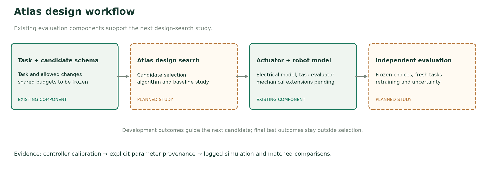
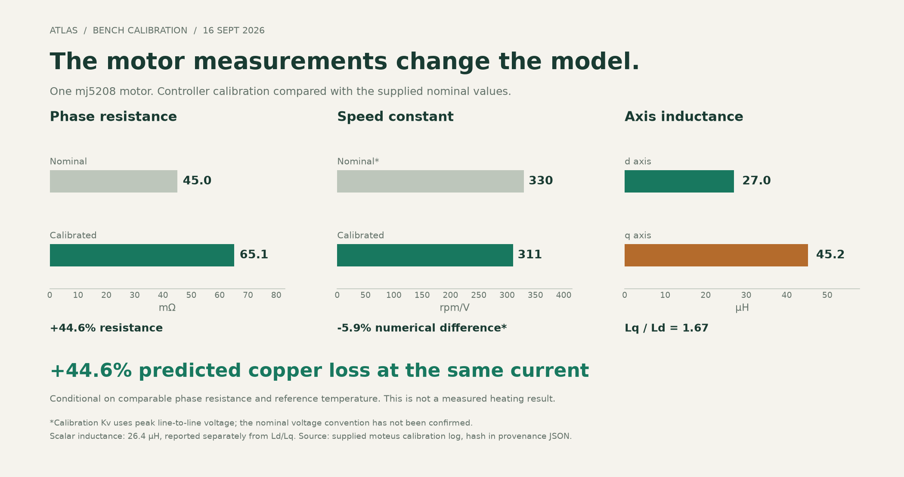
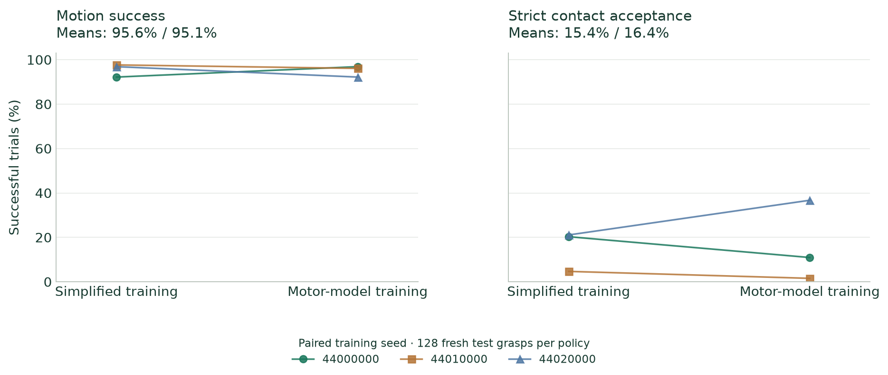
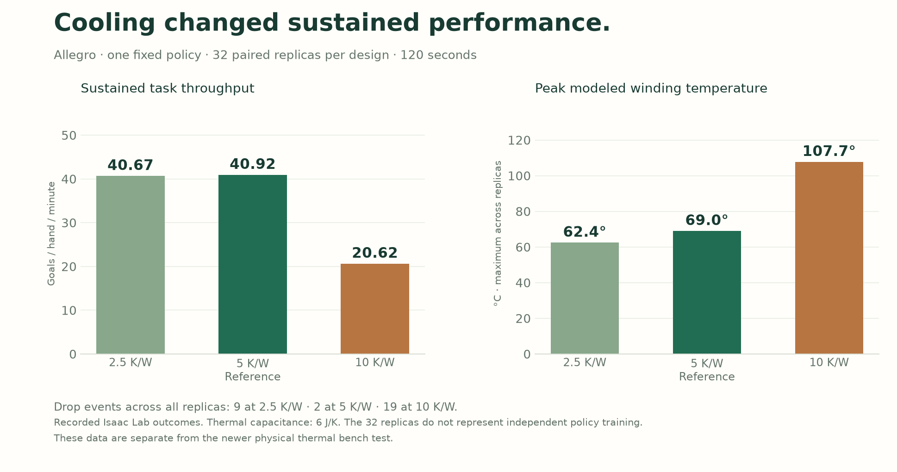

# Atlas: Task-Driven Actuator Design with Measured Motor Models

**Atlas Motion Systems · Working manuscript · 22 September 2026**

*Electrical calibration, the Isaac Lab cooling sweep and matched hand experiments are complete. The actuator-design search and unseen-task improvement study are specified here as planned work; this draft reports no completed design-search advantage. Author list to be finalized by the team.*

## Abstract

Actuator selection and robot control are coupled: winding, gearing, mass distribution and drive limits determine which commanded motions a robot can execute. We describe Atlas, our system for developing task-driven actuator designs, and report the electrical calibration and simulation experiments supporting its evaluation. Controller calibration of an mj5208 motor gives 65.075 mΩ phase resistance, compared with the supplied nominal input of 45 mΩ, and unequal d/q inductances of 27.011 and 45.242 μH. Under matching current and resistance conventions, the resistance difference implies 44.6% greater predicted copper loss; this electrical record does not itself measure shaft torque or thermal response. In a completed 32-replica cooling sweep, doubling modeled thermal resistance reduces hand throughput from 40.92 to 20.62 goals per minute. We incorporate the electrical inputs into a virtual hand drive in Isaac Lab and compare simplified and motor-model fine-tuning across three paired training seeds. Cold-test motion success is 95.6% and 95.1%, respectively, with no demonstrated advantage from motor-model training. Recorded torque delivery rarely differs from the already-clipped command in this workload. We specify a subsequent evaluation of Atlas's actuator design search against matched baselines, including physical design constraints, independent test tasks and equal-budget controller adaptation. The central question is whether task-level evaluation and measured inputs change which designs are selected and improve their performance on unseen tasks.

## 1. Introduction

A robot's task imposes more than a peak-torque requirement. Fast repositioning, sustained contact and recovery from disturbances can impose different demands on motor speed, current, inertia and cooling. A design that looks preferable under one actuator model may therefore be a poor choice under another. The practical design question is which motor and transmission should be selected for the motions the robot must repeatedly perform.

Atlas is the system our team is building for this design process. Its intended workflow connects constrained actuator candidates to robot-task evaluation and design revision. The accompanying demonstration makes that workflow inspectable: a grid of candidate robots, visible winding/gearing/placement changes, and the selected design evaluated on a challenge excluded from selection. The robot controller and the actuator-design search have separate roles. External pretrained policies are credited as initialization or control baselines.

This manuscript currently contributes an auditable electrical-calibration intake, a completed cooling-resistance sweep, a matched three-seed actuator-training comparison, and a specified evaluation protocol for the broader design claim. The completed results support calibrated electrical inputs and a workload with little observed sensitivity to the actuation law. They do not yet establish that Atlas selects superior actuator designs. The design-search result remains the central experiment needed for the final paper.

## 2. Related work and intended contribution

Shin et al. incorporate motor torque–speed limits into reinforcement learning for quadrupedal locomotion, showing that actuator feasibility is already an established consideration in policy training [1]. Our intended question concerns the consequences of modeling choices for hardware selection, alongside controller adaptation.

Huang et al. jointly optimize geared actuator hardware and task-specific control, using surrogate motor evaluation and mixed-variable optimization, and report fabrication and experiments on a jumping leg [2]. Their work is close prior art. Task-oriented motor/gearbox optimization alone is not a sufficient novelty claim for Atlas. Our proposed contribution must be supported by evidence about measured-input model selection, learned-policy adaptation, uncertainty and evaluation across tasks.

Eureka uses language models to search reward programs for reinforcement learning [3]. That is a different optimization target from choosing an actuator's physical parameters. The reference hand checkpoint used in our completed study comes from Dexterous Astra [4]; Atlas adds its own matched fine-tuning and actuator comparison. Isaac Lab supplies the simulation and learning framework [5]. We do not attribute creation of Atlas's design system to the external policy project.

## 3. Atlas design and evaluation system

### 3.1 Implemented components

The current repository contains an actuator model, explicit design interventions, an Isaac Lab course evaluator and a public replay interface. The actuator model represents electrical constraints, a first-order current response and a lumped thermal state. The course candidate importer validates bounded changes to Kv, gear ratio, current and added mass. A winding intervention changes torque constant, resistance and inductance together under its stated fixed-copper-volume approximation. These are model interventions, not manufacturer-qualified motor designs.

The implementation distinguishes raw controller demand, the request after nominal torque clipping and delivered effort. This distinction is necessary when attributing a task outcome to actuator limits. Logged simulated body poses drive the orbitable replay; rendered videos and replay telemetry retain the same run identifier.

### 3.2 Design search and mechanical extensions: pending

The design-search algorithm, its training data if any, surrogate architecture if used, acquisition/selection rule, initialization and stopping conditions must be documented with the implementation before a search-performance claim is made. The existing candidate grid is not evidence of a trained design model. This draft does not assume that Atlas uses a language model, invent an optimizer architecture, or claim a completed autonomous search.

Motor placement and transmission dynamics require additional mechanical modeling. The existing course importer adds mass at carrier centers of mass and retains native joint armature. A placement study must instead update the relevant centers of mass, inertia tensors, geometry and transmission properties; gear changes must account for reflected rotor inertia and transmission mass. A visual relocation alone is not a physical design intervention.

*Figure 1. Atlas workflow and evidence status. Solid boxes identify existing components. Dashed boxes identify work needed for the complete design-search comparison. This is a system diagram, not a record of a completed optimization run.*

## 4. Electrical calibration and model assumptions

### 4.1 Calibration evidence

The supplied September 16 mj5208 calibration was recorded with moteus 1.1.1. Its raw-log hash and controller firmware revision are retained in the evidence bundle [6–8]. The available evidence consists of one controller calibration, without an accompanying load-cell torque curve or repeatability study. Atlas has since reported a newer physical thermal bench test; its record will be incorporated in a subsequent revision. The completed Isaac Lab cooling experiment is reported below. Calibration resistance temperature is unspecified.

| Quantity | Supplied nominal input | Controller calibration |
|---|---:|---:|
| Phase resistance | 45 mΩ | 65.075 mΩ |
| Kv | 330 rpm/V; convention unconfirmed | 310.675 rpm/V, peak line-to-line |
| Scalar inductance | 30 μH | 26.362 μH |
| d-axis inductance | Equal-axis assumption supplied | 27.011 μH |
| q-axis inductance | Equal-axis assumption supplied | 45.242 μH |
| Pole count | 14 | 14 |

The resistance difference is 44.6%. At matched phase current and reference temperature, predicted copper loss scales by the same factor. This is a conditional loss calculation, not an observed 44.6% temperature increase or evidence of a general datasheet error. The nominal and calibrated resistance measurement conditions have not been matched independently. The scalar inductance is a separate fit, not the arithmetic mean of the two axis values.

*Figure 2. Electrical inputs and their conditional loss implication. Kv's numerical difference is shown with its convention caveat. The motor calibration does not measure robot performance.*

### 4.2 Torque conventions and virtual transmission

The handoff's 0.030737 N·m/A value is derived from Kv, rather than measured shaft torque. Mapping the recorded tool and firmware conventions to peak q-axis current gives **0.026619 N·m per peak-q ampere**, the value used in the completed study [6,8]. Separate Ld/Lq values are preserved in the model. Their inequality alone does not validate maximum-torque-per-amp performance over an operating range.

The virtual hand drive assumes a 12 V supply, 2 A peak and 1 A continuous current, and 80% transmission efficiency. Per-joint gearing preserves native nominal cold stall ceilings. Native hand geometry, body mass and inertia are retained. The remote-drive interpretation is a simulation case, without a packaging claim; rotor inertia, backlash, cable compliance and fitted motor friction are absent. The requested 200 Hz calibration bandwidth is approximated as current lag, not treated as a measured frequency response.

### 4.3 Thermal test settings

| Setting | Plugin default | Earlier hands | Earlier legs | Latest pen |
|---|---:|---:|---:|---:|
| Thermal resistance, K/W | 1.8 | 5 | 5 | 10 |
| Thermal capacitance, J/K | 80 | 6 | 8 | 8 |
| RC time constant, s | 144 | 30 | 40 | 80 |
| Derating begins, °C | 25 | 25 | 25 | 25 |
| Continuous-current limit reached, °C | 120 | 70 | 85 | 85 |

These are the thermal settings used in the separate simulation experiments. Their task-level effects were tested; they should not be conflated with parameters fitted from the newer physical bench test. The supplied mj5208 prior of 3–6 K/W and 15–100 J/K implies time constants from 45 to 600 seconds. It is not a fitted confidence interval. In the implemented law, the listed terminal temperatures are endpoints of a linear peak-to-continuous current reduction. The latest pen model reduces its limit from 2 A at 25°C to 1 A at 85°C. The time constant is not the time to overheating. No motor-friction estimate can be inferred from the handoff's proposed stall-intercept procedure without measurement data.

### 4.4 Completed cooling-resistance experiment

The Allegro design sweep includes 18 actuator variants, 32 paired physical simulation replicas per variant and 120 seconds per replica, with one fixed policy. Three conditions vary thermal resistance while retaining thermal capacitance at 6 J/K. The recorded outcomes are [9]:

| Thermal resistance | Goals / hand / minute | Peak modeled winding temperature | Drop events across 32 replicas |
|---|---:|---:|---:|
| 2.5 K/W | 40.67 | 62.4°C | 9 |
| 5 K/W, reference | 40.92 | 69.0°C | 2 |
| 10 K/W | 20.62 | 107.7°C | 19 |

Doubling thermal resistance reduces mean throughput by 20.30 goals per hand per minute, or 49.6%. The recorded paired bootstrap interval for the throughput difference is −21.31 to −19.28 goals per minute, conditional on the fixed policy and startup replicas. Halving resistance leaves mean throughput close to the reference but produces more drops. Thus this experiment demonstrates a substantial cooling-related task effect without establishing a universal optimal cooling configuration.

Startup mass, inertia, center of mass, friction and gains are paired; normal episode resets remain. Reorientation goals are consumed on success or reset, so later goal timing can diverge with behavior. Temperature is a recorded simulation state, and the peak is the maximum across joints, time and replicas. This experiment is separate from the newer physical bench test. Figure A1 presents the completed sweep, rather than an illustrative cooling curve.

## 5. Completed experiment: matched hand-policy adaptation

### 5.1 Protocol

We use the supplied Sharpa pen checkpoint [4] as a common initialization and run Atlas PPO fine-tuning with our own reward. This is not a reproduction of the reference project's original training process. Both conditions use the same explicit PD gains, task objective, observations, geometry, prepared grasps and frozen normalization. The simplified condition has constant nominal torque ceilings; the motor condition adds the calibrated electrical inputs and stated virtual drive/thermal assumptions.

Three paired training seeds—44000000, 44010000 and 44020000—each receive 4,194,304 transitions per condition: 256 iterations, 64 rollout steps and 256 environments. All training episodes begin at 25°C; within-episode heating is modeled and temperature is not observed by the policy. The final checkpoint is fixed before test evaluation. Separate validation uses 32 grasps at iterations 64, 128 and 256, without test-based checkpoint selection.

Each final policy and the unchanged reference policy is evaluated on 128 fresh grasps under three plants: fixed torque, cold motor and a 100°C-start motor stress case. The latter is an out-of-distribution scenario, not a measured operating condition. The primary metric requires three timed rotations, a supported hold, no drop, and the specified motion/settling checks. Stricter native contact and finger-participation criteria are separately reported [7].

### 5.2 Outcomes

| Test plant | Simplified-trained motion success | Motor-trained motion success |
|---|---:|---:|
| Fixed torque | 95.6% (95.3–96.1%) | 95.1% (93.0–99.2%) |
| Cold motor | 95.6% (92.2–97.7%) | 95.1% (92.2–96.9%) |
| 100°C start | 95.8% (94.5–97.7%) | 94.5% (91.4–96.1%) |

*Table 3. Means and ranges across three training seeds. Ranges are not confidence intervals. Each policy is evaluated on the same 128 test-grasp seeds.*

*Figure 3. Each connected pair represents one training seed under the same cold motor plant. The separate contact panel prevents motion success from being interpreted as full contact acceptance. All values are computed from the published study JSON.*

| Training seed | Cold motion: simplified / motor | Cold strict contact: simplified / motor |
|---|---:|---:|
| 44000000 | 118 / 124 | 26 / 14 |
| 44010000 | 125 / 123 | 6 / 2 |
| 44020000 | 124 / 118 | 27 / 47 |

*Table 4. Successful trials out of 128 in every entry. The effective training replication is three paired seeds, not 384 independent training runs.*

The cold motion difference, motor-trained minus simplified-trained, is −0.52 percentage points on average; individual paired differences have both signs. The study does not demonstrate a motor-aware training benefit or establish equivalence between methods. Contact acceptance is much lower and variable across seeds. The unchanged policy records 105/128 motion successes under fixed torque, 103/128 under the cold motor and 92/128 under hot-start stress.

### 5.3 Constraint activity and numerical checks

Cold delivered torque differs from the already-clipped request by more than 0.001 N·m in 0.030% of recorded joint samples, averaged over six trained policies. The corresponding hot-start fraction is 0.268%. These quantities include current lag and limits and use 60 Hz recordings; they do not count every physics substep. They indicate little recorded separation between actuation laws in the cold task and help explain why this experiment is a weak test of actuator-limited capability.

An electrical consistency check compares the 240 Hz fast approximation with substepped dq integration at 24 kHz, at prescribed motor speeds from 0 to 3400 rpm and a ±1.5 A q-axis request reversal. The largest transient torque difference is 0.00110 N·m; the settled difference is below 10⁻¹¹ N·m for these cases [7]. This verifies agreement between two software calculations on the tested cases, not agreement with measured shaft torque.

Validation means at iterations 64/128/256 are 85.4/92.7/91.7% for simplified training and 82.3/89.6/90.6% for motor training. The budget is larger than the earlier pilot, but convergence has not been established.

## 6. Planned experiment: does Atlas choose better actuators?

**This section specifies the next experiment. No outcomes are reported for it.** The detailed matrix and proposed budgets are in the companion experiment protocol.

### 6.1 Questions and baselines

We ask whether Atlas's design search improves held-out task completion over a fixed nominal design, uniform feasible random search and a conventional mixed-variable optimization baseline under identical evaluation budgets. The implementation and hyperparameters of all selection methods must be frozen before final tests. A second comparison holds the search method fixed and changes the model used for selection: simplified limits, nominal electrical parameters and calibrated electrical inputs plus declared uncertainty.

This separates two claims: that the search method is useful, and that better motor information changes the decision. Neither follows solely from a robot completing a course after a parameter change. If the measured mj5208 family is used, it must remain an explicitly virtual design with coherent transmission and placement assumptions. It cannot be relabeled as calibrated ANYmal or G1 hardware.

### 6.2 Tasks and design constraints

The first task is the existing 19 m ANYmal course, with stairs, a step-over gap, raised crossing, rubble, side slope and a repeatable disturbance. Current recorded variants are single-seed development examples. Their geometry, thresholds and outcomes cannot also serve as an untouched final test. Fresh procedural seeds and withheld combinations of obstacle/load conditions will be generated before evaluating the selected design.

The companion arm task should expose a different demand: repeated timed pick-and-place or catch-and-place with varied object mass and arrival timing. The task and scoring must be fixed before design ranking. It is a planned second-task evaluation, not an existing result. Continuous-duty trials can assess sensitivity to thermal assumptions; hot starts remain a separate stress condition.

Candidate designs obey common actuator mass, bus voltage, current and packaging budgets. Winding choices are physically coupled, gearing includes reflected inertia and efficiency, and placement updates moving-body mass properties. Parameters that lack validation receive declared sensitivity ranges. The feasible design family is explicit; the experiment does not claim unrestricted electromagnetic geometry synthesis or manufacturing validation.

### 6.3 Selection, control adaptation and unseen tests

During search, use a common frozen controller to isolate candidate selection under fixed control. Select designs using development and validation tasks only. Then compare the chosen designs and nominal baseline both with the common controller and with equally budgeted retraining from the same initialization. Report the two comparisons separately: retraining selected designs does not establish a globally optimal joint hardware–policy solution.

Repeat the complete search independently and treat each search run as a statistical unit. Repeated task instances and policy seeds are nested within it. Report paired effects and uncertainty at the search level, along with task-level distributions. Course failures, infeasible designs and simulator failures remain in the run ledger with distinct reasons. The experiment protocol specifies how they consume the evaluation budget.

Completion under the fixed resource limits is the primary outcome. Secondary outcomes include traversal time, tracked joint speed, requested/delivered torque, constraint exposure, simulated copper loss and thermal sensitivity. Measured battery energy and measured winding temperature are not available. Any Pareto result uses clearly defined quantities, reports failed trials separately and avoids making slow or failed trials look efficient through reduced work.

## 7. Discussion and limitations

The completed hand experiment shows why a more detailed model should be evaluated through its consequences for a specific workload. Electrical calibration changes inputs substantially, but that alone does not imply a policy or design advantage. The cold hand task rarely separates the torque laws and gives no clear training benefit. A successful course demo would still require repeated evaluation and an untouched test to establish improvement beyond a selected video.

Hardware evidence currently covers one motor's controller-derived electrical parameters. Mechanical packaging, shaft torque and simulation contact accuracy remain unvalidated by the available records. Comparison with the newly completed physical thermal test requires its measurement record and identification of the relevant temperature sensor/node; the simulated cooling outcomes are already reported. The reference simulator shares assumptions with training. A future result that is robust across stated software uncertainty scenarios would be useful evidence for software design selection, not proof of physical transfer.

The strategic value of Atlas is the connection between design choices, measurements and task outcomes. A versioned record can expose which model assumptions affect decisions and direct subsequent calibration. Whether that record produces better recommendations across motor families and new tasks is a further empirical question. It does not follow from the present study that Atlas has a general actuator-design advantage.

## 8. Reproducibility and accompanying release

The completed hand study is available with synchronized videos, orbitable body-state replays, outcomes and training logs [7]. Its protocol and calibration conversion are pinned to repository commit `edfaf2f252d9f75fb3ae8f92cbe87bd05240685a`. The hand runs use Isaac Lab 2.3.2 / Isaac Sim 5.1. Earlier locomotion work has a separate environment version; a final cross-task release must identify each runtime rather than imply all runs share one.

The final release will link a paper, the candidate-grid film, the interactive comparison page, and an experiment manifest. Every published candidate must map to a configuration, policy checkpoint, seed list, result record and replay. Licensing and attribution for the external hand checkpoint/assets and simulator remain attached. The narrative and statistical tables must point to the same evaluated runs.

The manuscript is ready for internal review of its completed evidence and proposed method. Submission as a full actuator-design result requires the implemented search description, mechanically consistent candidates, baseline comparisons, repeated independent searches and untouched test outcomes described in Section 6.

## Appendix A. Completed cooling-sweep results

*Figure A1. Completed Allegro cooling sweep: 32 replicas per design, 120 seconds, one fixed policy. The chart reports task throughput and maximum modeled winding temperature. Thermal capacitance remains 6 J/K; all three cooling variants and their drop counts are retained. The physical thermal bench results will be added separately with their source record.*

## References

1. Young-Ha Shin, Tae-Gyu Song, Gwanghyeon Ji and Hae-Won Park. **Actuator-Constrained Reinforcement Learning for High-Speed Quadrupedal Locomotion.** arXiv:2312.17507, 2023. [Paper](https://arxiv.org/abs/2312.17507).

2. Xuanyu Huang, Jianqiang Dong and Hang Zhao. **Task-Oriented Co-Design and Optimization of Geared Actuators for Robotic Applications.** arXiv:2609.22795, 2026. [Paper](https://arxiv.org/abs/2609.22795).

3. Yecheng Jason Ma et al. **Eureka: Human-Level Reward Design via Coding Large Language Models.** ICLR 2024; arXiv:2310.12931. [Paper](https://arxiv.org/abs/2310.12931).

4. **Dexterous Astra.** Reference environments, assets and trained checkpoints. [Repository](https://github.com/jianglongye/dexterous-astra). Accessed September 22, 2026.

5. **Isaac Lab.** NVIDIA and contributors. [Repository](https://github.com/isaac-sim/IsaacLab). The completed hand experiment pins the runtime version stated above.

6. **moteus controller firmware.** Revision `6f063a90a97012dc9f6ccc420390c5a6cc55fac7`, torque/current convention. [Source](https://github.com/mjbots/moteus/blob/6f063a90a97012dc9f6ccc420390c5a6cc55fac7/fw/bldc_servo.cc).

7. **Atlas bench-informed hand study.** Protocol, outcomes, training logs and numerical audits. [Viewer](https://theenergynerd.github.io/actuator-model-problem/lab/#pen); [results](https://theenergynerd.github.io/actuator-model-problem/lab/data/pen/bench/study.json); [protocol](https://github.com/TheEnergyNerd/actuator-model-problem/blob/edfaf2f252d9f75fb3ae8f92cbe87bd05240685a/isaac/pen/BENCH_STUDY.md).

8. **Atlas calibration evidence and conversion.** Supplied raw moteus log, September 16, 2026, SHA-256 `1e1b08b78c474780261213c34723f02d504bbc77c3140a81100e5b2ac133b4bc`. [Evidence](https://theenergynerd.github.io/actuator-model-problem/lab/data/pen/bench/evidence.json); [conversion](https://github.com/TheEnergyNerd/actuator-model-problem/blob/edfaf2f252d9f75fb3ae8f92cbe87bd05240685a/isaac/pen/bench_profile.py).

9. **Atlas Allegro design sweep.** Completed September 10, 2026, Isaac Lab 2.1 / Isaac Sim 4.5 / RSL-RL 2.3.1. [Full results](https://theenergynerd.github.io/actuator-model-problem/assets/research/data/cooling-source.json); [comparison and conditions](https://theenergynerd.github.io/actuator-model-problem/assets/research/data/cooling-summary.json).
